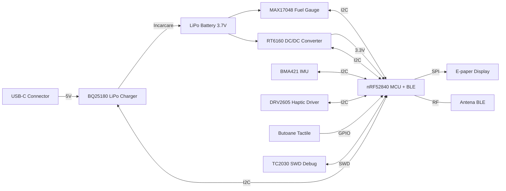

# InkTime Smart Watch

### Diagrama bloc

### BOM (Bill of Materials)

| Componentă | Descriere | Capsulă | Link JLC Parts | Datasheet |
| :--- | :--- | :--- | :--- | :--- |
| **nRF52840-QIAA-R** | MCU Bluetooth 5.4, ARM Cortex-M4F | aQFN73 | [Link JLC (C190794)](https://jlcpcb.com/parts/productDetail/190794) | [Datasheet](https://infocenter.nordicsemi.com/pdf/nRF52840_PS_v1.1.pdf) |
| **BQ25180YBGR** | LiPo Charger & Power Path Management | DSBGA-8 | [Link JLC (C3682423)](https://jlcpcb.com/parts/productDetail/3682423) | [Datasheet](https://www.ti.com/lit/ds/symlink/bq25180.pdf) |
| **RT6160AWSC** | Buck-Boost DC/DC Converter 3.3V | WLCSP-15 | [Link JLC (C7065276)](https://jlcpcb.com/parts/productDetail/7065276) | [Datasheet](https://www.richtek.com/assets/product_file/RT6160/DS6160-01.pdf) |
| **MAX17048G+T10** | Fuel Gauge (Monitorizare baterie) | DFN-8 | [Link JLC (C2682616)](https://jlcpcb.com/parts/productDetail/2682616) | [Datasheet](https://datasheets.maximintegrated.com/en/ds/MAX17048-MAX17049.pdf) |
| **BMA421** | Accelerometru (Pedometer embedded) | LGA-12 | [Link JLC (C5242966)](https://jlcpcb.com/parts/productDetail/5242966) | [Datasheet](https://media.digikey.com/pdf/Data%20Sheets/Bosch/BMA421_Flyer.pdf) |
| **DRV2605LDGSR** | Haptic Driver (Control vibrații) | VSSOP-10 | [Link JLC (C527464)](https://jlcpcb.com/parts/productDetail/527464) | [Datasheet](https://www.ti.com/lit/ds/symlink/drv2605l.pdf) |
| **LCM1027B3605F** | Motor vibrații ERM (Shaker) | Wire | [Link JLC (C7528806)](https://jlcpcb.com/parts/productDetail/7528806) | [Datasheet](https://cdn.tme.eu/hist/W/W08/LCM1027B3605F.pdf) |
| **SI2301CDS** | P-Channel MOSFET (EPD Power Gating) | SOT-23 | [Link JLC (C10487)](https://jlcpcb.com/parts/productDetail/10487) | [Datasheet](https://www.vishay.com/docs/66709/si2301cds.pdf) |
| **Cristal 32MHz** | Cuarț extern (HFXO) nRF52840 | 2016-4P | [Link JLC (C394947)](https://jlcpcb.com/parts/productDetail/394947) | [Datasheet](https://jlcpcb.com/parts/productDetail/394947) |
| **Cristal 32.768kHz**| Cuarț extern (LFXO) nRF52840 | 3215-2P | [Link JLC (C32346)](https://jlcpcb.com/parts/productDetail/32346) | [Datasheet](https://jlcpcb.com/parts/productDetail/32346) |
| **Inductor 0.47µH** | Inductor putere pentru RT6160 | 0805 | [Link JLC (C2828026)](https://jlcpcb.com/parts/productDetail/2828026) | [Datasheet](https://jlcpcb.com/parts/productDetail/2828026) |
| **Cond. 100nF** | Decuplare (Standard) | 0201 | [Link JLC (C30733)](https://jlcpcb.com/parts/productDetail/30733) | [Datasheet](https://jlcpcb.com/parts/productDetail/30733) |
| **Cond. 10µF** | Filtrare (RT6160 OUT, BQ SYS) | 0402 | [Link JLC (C15525)](https://jlcpcb.com/parts/productDetail/15525) | [Datasheet](https://jlcpcb.com/parts/productDetail/15525) |
| **Rezistență 10kΩ** | Pull-up magistrală I2C | 0201 | [Link JLC (C32512)](https://jlcpcb.com/parts/productDetail/32512) | [Datasheet](https://jlcpcb.com/parts/productDetail/32512) |
