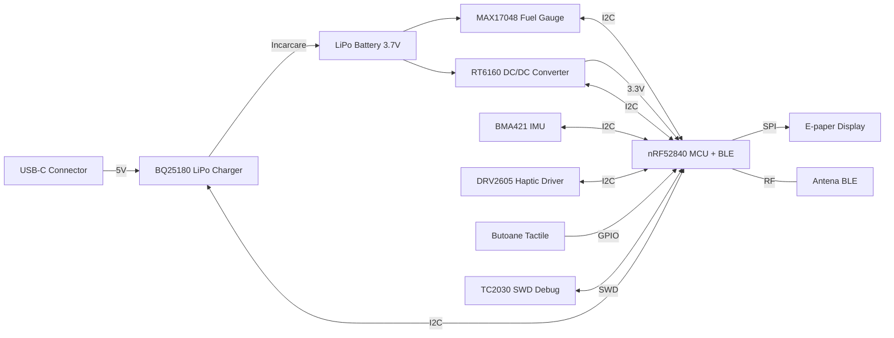

# InkTime Smart Watch

## Diagrama bloc

### BOM (Bill of Materials)

| Componentă | Descriere | Capsulă | Cod JLC | Datasheet |
| :--- | :--- | :--- | :--- | :--- |
| **nRF52840-QIAA-R** | MCU Bluetooth 5.4, ARM Cortex-M4F | aQFN73 | C190794 | [Datasheet](https://infocenter.nordicsemi.com/pdf/nRF52840_PS_v1.1.pdf) |
| **BQ25180YBGR** | LiPo Charger & Power Path Management | DSBGA-8 | C3682423 | [Datasheet](https://www.ti.com/lit/ds/symlink/bq25180.pdf) |
| **RT6160AWSC** | Buck-Boost DC/DC Converter 3.3V | WLCSP-15 | C7065276 | [Datasheet](https://www.richtek.com/assets/product_file/RT6160/DS6160-01.pdf) |
| **MAX17048G+T10** | Fuel Gauge (Monitorizare baterie) | DFN-8 | C2682616 | [Datasheet](https://datasheets.maximintegrated.com/en/ds/MAX17048-MAX17049.pdf) |
| **BMA421** | Accelerometru (Pedometer embedded) | LGA-12 | C5242966 | [Datasheet](https://www.bosch-sensortec.com/media/boschsensortec/downloads/datasheets/bst-bma421-ds000.pdf) |
| **Inductor 0.47µH** | Inductor putere pentru RT6160 | 0805 | C2828026 | [Datasheet](https://jlcpcb.com/parts/productDetail/2828026) |
| **Inductor 10µH** | nRF52840 DC/DC (DCC Network) | 0603 | C396914 | [Datasheet](https://jlcpcb.com/parts/productDetail/396914) |
| **Inductor 15nH** | nRF52840 DC/DC (DCC Network) | 0402 | C406859 | [Datasheet](https://jlcpcb.com/parts/productDetail/406859) |
| **Cristal 32MHz** | Cuarț extern (HFXO) nRF52840 | 2016-4P | C394947 | [Datasheet](https://jlcpcb.com/parts/productDetail/394947) |
| **Cristal 32.768kHz**| Cuarț extern (LFXO) nRF52840 | 3215-2P | C32346 | [Datasheet](https://jlcpcb.com/parts/productDetail/32346) |
| **Cond. 100nF** | Decuplare (Standard) | 0201 | C30733 | [Datasheet](https://jlcpcb.com/parts/productDetail/30733) |
| **Cond. 1µF** | Decuplare (DEC4/6, BQ IN/BAT) | 0402 | C52923 | [Datasheet](https://jlcpcb.com/parts/productDetail/52923) |
| **Cond. 10µF** | Filtrare (RT6160 OUT, BQ SYS) | 0402 | C15525 | [Datasheet](https://jlcpcb.com/parts/productDetail/15525) |
| **Rezistență 10kΩ** | Pull-up magistrală I2C | 0201 | C32512 | [Datasheet](https://jlcpcb.com/parts/productDetail/32512) |
| **Rezistență 100kΩ** | Pull-up poartă PFET Display | 0201 | C32513 | [Datasheet](https://jlcpcb.com/parts/productDetail/32513) |
| **DRV2605LDGSR** | Haptic Driver (Control vibrații) | VSSOP-10 | C527464 | [Datasheet](https://www.ti.com/lit/ds/symlink/drv2605l.pdf) |
| **SI2301CDS** | P-Channel MOSFET (Power Gating EPD) | SOT-23 | C10487 | [Datasheet](https://www.vishay.com/docs/66709/si2301cds.pdf) |

