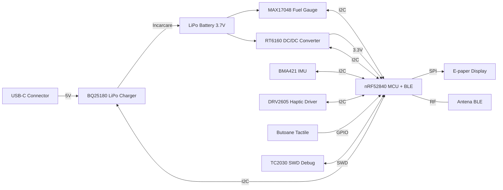

# InkTime Smart Watch

### Diagrama bloc

### BOM (Bill of Materials)

| Componentă | Descriere | Capsulă | Link JLC Parts | Datasheet |
| :--- | :--- | :--- | :--- | :--- |
| **nRF52840-QIAA-R** | MCU Bluetooth 5.4, ARM Cortex-M4F | aQFN73 | [Link JLC (C190794)](https://jlcpcb.com/parts/componentSearch?searchTxt=C190794) | [Datasheet](https://www.nordicsemi.com/Products/nRF52840) |
| **BQ25180YBGR** | LiPo Charger & Power Path | DSBGA-8 | [Link JLC (C3682423)](https://jlcpcb.com/parts/componentSearch?searchTxt=C3682423) | [Datasheet](https://www.ti.com/product/BQ25180) |
| **RT6160AWSC** | Buck-Boost DC/DC Converter 3.3V | WLCSP-15 | [Link JLC (C7065276)](https://jlcpcb.com/parts/componentSearch?searchTxt=C7065276) | [Datasheet](https://www.richtek.com/Products/Switching%20Regulators/Buck-Boost%20Converter/RT6160A) |
| **MAX17048G+T10** | Fuel Gauge (Baterie) | DFN-8 | [Link JLC (C2682616)](https://jlcpcb.com/parts/componentSearch?searchTxt=C2682616) | [Datasheet](https://www.analog.com/en/products/max17048.html) |
| **BMA421** | Accelerometru (Pedometer) | LGA-12 | [Link JLC (C5242966)](https://jlcpcb.com/parts/componentSearch?searchTxt=C5242966) | [Datasheet](https://www.bosch-sensortec.com/products/motion-sensors/accelerometers/bma421/) |
| **DRV2605LDGSR** | Haptic Driver (Vibrații) | VSSOP-10 | [Link JLC (C527464)](https://jlcpcb.com/parts/componentSearch?searchTxt=C527464) | [Datasheet](https://www.ti.com/product/DRV2605L) |
| **LCM1027B3605F** | Motor vibrații ERM | Wire | [Link JLC (C7528806)](https://jlcpcb.com/parts/componentSearch?searchTxt=C7528806) | [Datasheet](https://www.tme.eu/ro/details/lcm1027b3605f/motoare-dc/liwang-micro-motor/) |
| **SI2301CDS** | P-Channel MOSFET | SOT-23 | [Link JLC (C10487)](https://jlcpcb.com/parts/componentSearch?searchTxt=C10487) | [Datasheet](https://www.vishay.com/product?docid=66709) |
| **Cristal 32MHz** | Cuarț extern (HFXO) | 2016-4P | [Link JLC (C394947)](https://jlcpcb.com/parts/componentSearch?searchTxt=C394947) | [Datasheet](https://www.lcsc.com/product-detail/C394947.html) |
| **Cristal 32.768kHz**| Cuarț extern (LFXO) | 3215-2P | [Link JLC (C32346)](https://jlcpcb.com/parts/componentSearch?searchTxt=C32346) | [Datasheet](https://www.lcsc.com/product-detail/C32346.html) |
| **Inductor 0.47µH** | Inductor putere (RT6160) | 0805 | [Link JLC (C2828026)](https://jlcpcb.com/parts/componentSearch?searchTxt=C2828026) | [Datasheet](https://www.lcsc.com/product-detail/C2828026.html) |
| **Cond. 100nF** | Decuplare (Standard) | 0201 | [Link JLC (C30733)](https://jlcpcb.com/parts/componentSearch?searchTxt=C30733) | [Datasheet](https://www.lcsc.com/product-detail/C30733.html) |
| **Cond. 10µF** | Filtrare (RT6160, BQ SYS) | 0402 | [Link JLC (C15525)](https://jlcpcb.com/parts/componentSearch?searchTxt=C15525) | [Datasheet](https://www.lcsc.com/product-detail/C15525.html) |
| **Rezistență 10kΩ** | Pull-up magistrală I2C | 0201 | [Link JLC (C32512)](https://jlcpcb.com/parts/componentSearch?searchTxt=C32512) | [Datasheet](https://www.lcsc.com/product-detail/C32512.html) |
